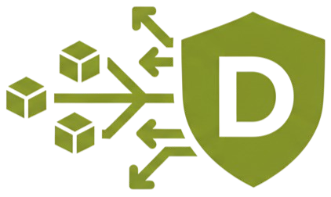

<div align="center">
  
</div>

# Dits

**Open, local-first version control for large media and asset pipelines.**

Dits gives large binary projects an inspectable history without storing every
version as another complete copy. The current alpha CLI chunks files with
FastCDC, addresses objects with BLAKE3, verifies content on read, and provides a
Git-like local workflow. The longer-term system adds structure-aware media,
semantic edit and dependency graphs, and verified collaboration over the same
open object model.

> **Alpha — v0.1.5.** Use Dits for evaluation and local experiments, not as the
> only copy of important data. Network `push`/`pull`/`fetch`/`sync`, P2P, hosted
> services, and official SDKs are not shipped. The authoritative capability
> record is [docs/STATUS.md](docs/STATUS.md).

## The product thesis

Generic large-file storage can tell you that bytes changed. A useful creative
history should eventually explain the result:

1. **Exact history** — preserve and verify the original bytes.
2. **Structural history** — understand supported containers, samples, frames,
   layers, and dependencies without replacing the original.
3. **Semantic history** — record edits, timelines, derivations, render recipes,
   tools, color configuration, and provenance.
4. **Verified collaboration** — move only missing objects while keeping object
   verification and ref updates independent of the transport or hosted service.

The first layer works locally today. MP4 structure handling and FACR experiments
begin the second layer. The semantic graph and complete remote protocol remain
roadmap work.

## Why this is different

Content-defined chunking alone is useful but no longer unique. Dits is designed
to combine an exact byte CAS with a version-control graph and media-aware
extensions:

- immutable, content-addressed objects;
- commits, refs, branches, tags, diffs, locks, and recovery tools;
- Git-quality text handling alongside binary chunk manifests;
- exact imported masters plus separately addressed renditions;
- interoperable timeline and asset references rather than a proprietary editor;
- a future remote protocol whose semantics are not coupled to HTTP, QUIC, P2P,
  or a particular cloud.

The target is closer to **Git plus a reproducible build graph for media** than a
new cloud drive or a Git LFS wrapper.

## Try the local engine

The published v0.1.5 npm artifact contains Apple-silicon macOS and Windows x64
binaries. Other targets currently require the source build in
[Getting started](docs/user-guide/getting-started.md).

```bash
npm install -g @byronwade/dits

mkdir dits-demo
cd dits-demo
dits init
dits add ./path/to/large-file.bin
dits commit -m "initial asset snapshot"
dits status
dits log
```

The launcher selects a binary already contained in the package; it does not
download one during installation. Dits is not currently published to crates.io
or Homebrew, and there is no `curl | sh` installer.

## What works today

The canonical product is the root Rust workspace:

```text
packages/dits-core   deterministic FastCDC/BLAKE3 engine
apps/cli             repository library and `dits` command-line interface
```

Current local capabilities include:

- content-addressed chunk storage, deduplication, read verification, and
  byte-exact reconstruction;
- local add/status/commit/log/checkout plus branches, tags, diff, merge,
  rebase, stash, reflog, bisect, worktrees, sparse checkout, and other familiar
  version-control operations;
- hybrid text and binary storage;
- bounded MP4/ISOBMFF structure inspection and reconstruction paths;
- local locks, integrity checking, audit, metadata, dependency, lifecycle,
  proxy, and repository-inspection commands;
- experimental FACR video/photo workflows that require FFmpeg;
- an experimental, feature-gated local FUSE mount;
- local filesystem clone/object transfer and an embedded per-repository object
  server.

See [docs/STATUS.md](docs/STATUS.md) and the generated
[CLI reference](docs/user-guide/cli-reference.md) for exact command-level
limitations.

## What is not shipped

- Internet-capable repository `push`, `pull`, `fetch`, `sync`, or network clone.
- Remote ref transactions, remote lock leases, or remote on-demand hydration.
- P2P discovery, NAT traversal, or peer repository transfer.
- A managed DitsHub service, REST API, webhooks, or public SDK packages.
- A stable public repository format or third-party conformance guarantee.
- Production support for every MP4/MOV variant or every creative file format.

The repository contains experiments and design documents for several of these
areas. They are evidence and research, not shipped product surface.

## Architecture

```text
semantic edits, timelines, dependencies, provenance       design
structure-aware media and renditions                       bounded / experimental
commits, trees, manifests, refs                             current local engine
chunks, blobs, verification, atomic storage                current trust core
```

Lower layers do not depend on hosted-service policy. Originals remain exact
objects; decoded identities, perceptual features, proxies, and exports are
separate representations with explicit fidelity contracts.

Read:

- [Active architecture](docs/architecture/active-architecture.md)
- [Technical foundations](docs/research/technical-foundations.md)
- [ADR 0001 — one canonical engine](docs/adr/0001-one-canonical-engine.md)
- [ADR 0002 — exact CAS and semantic media graph](docs/adr/0002-exact-cas-semantic-media-graph.md)

## Evidence, not promises

The checked-in machine-readable benchmark source is
[benchmarks/latest.json](benchmarks/latest.json). Its current measured
microbenchmarks were recorded on an Apple M2 Pro at commit `9b79be2`:

| Measurement | Result |
|---|---:|
| BLAKE3 hash, 1 MiB blocks | 1,809.96 MB/s |
| FastCDC chunking, 32 MiB input | 991.76 MB/s |
| SHA-256 hash, 1 MiB blocks | 348.37 MB/s |

These are component measurements, not end-to-end repository, network, memory,
or production-scale claims. See [benchmark policy](docs/performance/benchmarks.md)
and [performance engineering plan](docs/performance/engineering-plan.md).

## Roadmap

Work is ordered by proof and dependency, not feature count:

1. **Credibility and safety** — bounded-memory ingest, atomic publication,
   golden media corpus, crash and mutation tests.
2. **Repository contract** — versioned object envelopes, canonical encodings,
   compatibility policy, conformance vectors, repair behavior.
3. **Scale** — tree objects, packfiles, multi-pack indexes, indexed reachability,
   object-count benchmarks.
4. **Semantic media proof** — exact masters, OTIO-compatible edit graphs,
   renditions, color/fidelity contracts, optional C2PA bindings.
5. **Verified remote CAS** — find-missing, streaming transfer, resume, bundles,
   compare-and-swap refs, remote lock leases; HTTP first, optional QUIC/P2P later.
6. **Ecosystem** — adapters, independent readers, stable SDKs, and an optional
   hosted control plane built on the same public protocol.

See [ROADMAP.md](ROADMAP.md) for acceptance gates and issue links.

## Initial product wedge

Dits is being designed first for small and mid-sized game, virtual-production,
post-production, and VFX teams that already feel the limits of Git LFS, shared
drives, copied project folders, or expensive centralized infrastructure. The
first useful team product must provide migration, trustworthy remote sync,
binary locks, sparse workspaces, and integrations without requiring creators to
be Git experts.

## Documentation map

- [Documentation guide](docs/README.md) — authority and maturity rules
- [Implementation status](docs/STATUS.md) — what the code does today
- [Concepts](docs/concepts.md) — current object and repository model
- [Roadmap](ROADMAP.md) — ordered execution plan
- [Product direction](REVIEW-AND-VISION.md) — market and positioning decisions
- [Systems course](docs/education/course-standard.md) — teaching and
  conformance direction
- [Contributing](docs/development/contributing.md) — development workflow
- [Security](SECURITY.md) — reporting vulnerabilities

## Contributing

The highest-leverage work is tracked in issues
[#34](https://github.com/byronwade/dits/issues/34) through
[#40](https://github.com/byronwade/dits/issues/40). Changes that affect
persistent bytes, protocol behavior, media fidelity, or security require an ADR,
compatibility analysis, failure tests, and reproducible evidence.

```bash
git clone https://github.com/byronwade/dits.git
cd dits
cargo build --locked --workspace
cargo test --locked --workspace
bash scripts/check-cli-docs.sh
```

## License

Dits is dual-licensed under Apache-2.0 OR MIT.
