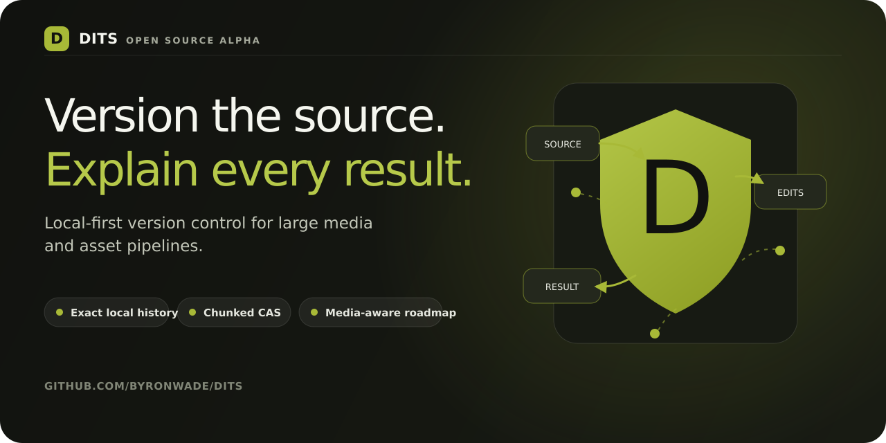

<div align="center">
  
</div>

<h1 align="center">Dits</h1>

<p align="center"><strong>Open, local-first version control for large media and asset pipelines.</strong></p>

<p align="center">
  Give mixed code-and-media projects Git-shaped local history with chunked,
  content-addressed storage—then help build the open model that can explain how
  every output was made.
</p>

<p align="center">
  <a href="https://github.com/byronwade/dits/actions/workflows/ci.yml"></a>
  <a href="https://www.npmjs.com/package/@byronwade/dits"></a>
  <a href="LICENSE"></a>
  <a href="https://github.com/byronwade/dits/stargazers"></a>
</p>

<p align="center">
  <a href="#try-dits-in-60-seconds"><strong>Quick start</strong></a> ·
  <a href="docs/STATUS.md"><strong>What works</strong></a> ·
  <a href="https://dits.byronwade.com"><strong>Website</strong></a> ·
  <a href="ROADMAP.md"><strong>Roadmap</strong></a> ·
  <a href="CONTRIBUTING.md"><strong>Contribute</strong></a>
</p>

> [!WARNING]
> **Alpha — v0.1.5.** Evaluate Dits on disposable or independently backed-up
> projects, not as the only copy of important data. The local engine works;
> Internet repository sync, P2P, hosted services, and official SDKs do not.
> See the [authoritative implementation status](docs/STATUS.md).

## Version the source. Explain every result.

Creative work is often versioned as `final-v7-really-final`, copied folders,
or opaque binary blobs. That preserves files, but not a trustworthy account of
what changed, which source produced an output, or how to reconstruct it.

Dits starts with the part that must be right first: exact local history.

| The problem | The Dits approach |
|---|---|
| Large binary revisions become whole-file copies | Split supported binary content with FastCDC and reuse byte-identical BLAKE3-addressed chunks |
| Code and assets live in separate histories | Keep Git-backed text history and chunked binary manifests in one local workflow |
| An exported file hides how it was produced | Build toward explicit edits, dependencies, timelines, and renditions without replacing exact masters |
| Collaboration can make an unsafe format fail faster | Stabilize verification, recovery, and the repository contract before shipping remote sync |

The destination is closer to **Git plus a reproducible build graph for media**
than another cloud drive or Git LFS wrapper.

## Try Dits in 60 seconds

The published v0.1.5 npm artifact contains Apple-silicon macOS and Windows x64
binaries. Other targets can [build from source](docs/user-guide/getting-started.md#build-the-source).
The release workflow already builds the full platform matrix for future
publishes.

```bash
npm install -g @byronwade/dits

mkdir dits-demo && cd dits-demo
dits init
printf 'first version\n' > notes.txt
dits add notes.txt
dits commit -m "First exact snapshot"
dits log
```

Then edit `notes.txt`, run `dits diff`, and commit again. The full
[safe evaluation guide](docs/user-guide/getting-started.md) covers restore and
hash verification.

The npm launcher uses a binary already contained in the package. Dits is not
currently published to crates.io or Homebrew, and there is no `curl | sh`
installer.

## What you can use today

The current Rust workspace provides a local, offline alpha:

- Git-shaped `init`, `add`, `status`, `commit`, `log`, `diff`, `checkout`,
  branch, tag, merge, rebase, stash, worktree, sparse-checkout, and recovery
  workflows;
- FastCDC chunking, BLAKE3 content IDs, byte-identical chunk reuse, verified
  reads, and byte-exact reconstruction paths;
- hybrid text and binary storage in one repository;
- local filesystem clone, integrity inspection, read-only GC reporting, locks,
  audit, metadata, dependency, lifecycle, and repository-inspection tools;
- bounded MP4/ISOBMFF handling plus experimental FACR video/photo, proxy, and
  feature-gated local FUSE paths.

```text
source files
   ├── text ───────────────→ embedded Git objects
   └── large binary/media ─→ FastCDC chunks ─→ BLAKE3-addressed objects
                                      ╲        ╱
                                       commit graph
```

The exact command-by-command boundary lives in
[`docs/STATUS.md`](docs/STATUS.md) and the generated
[`CLI reference`](docs/user-guide/cli-reference.md).

## What comes next

| Layer | Status | Goal |
|---|---|---|
| Exact source history | **Current alpha** | Verifiable local history and reconstruction for mixed text and binary projects |
| Media-aware storage | **Current + experimental** | Preserve exact masters while representing supported structure and derived renditions separately |
| Reproducible asset graph | **Research** | Make edits, dependencies, timelines, and provenance explicit and interoperable |
| Verified collaboration | **Roadmap** | Exchange missing objects and update refs safely over an open, transport-independent protocol |

Work is deliberately dependency-ordered: data safety → stable repository
contract → scale → semantic media proof → verified remote CAS → ecosystem.
Read the [roadmap and acceptance gates](ROADMAP.md).

## Built first for asset-heavy teams

Dits is being shaped around small and mid-sized teams that combine Git-shaped
engineering with large, frequently changing assets:

- **Game development** — code, textures, audio, models, and generated assets in
  one inspectable project history;
- **Virtual production and VFX** — exact masters plus explicit dependencies,
  proxies, and future timeline interchange;
- **Post-production** — source-preserving experiments around frames, audio,
  trims, EDL, and OTIO;
- **Tool builders and researchers** — an open object model, reproducible
  benchmarks, ADRs, and conformance work that can be independently reviewed.

These are the initial workflows and research direction, not claims of complete
production support today.

## Evidence, not adjectives

The checked-in [benchmark artifact](benchmarks/latest.json) records component
microbenchmarks on an Apple M2 Pro at commit `9b79be2`:

| Measurement | Result |
|---|---:|
| BLAKE3 hashing, 1 MiB blocks | 1,809.96 MB/s |
| FastCDC chunking, 32 MiB input | 991.76 MB/s |
| SHA-256 hashing, 1 MiB blocks | 348.37 MB/s |

These numbers measure components—not end-to-end repository speed, network
performance, memory use, storage savings, or production scale. See the
[benchmark policy](docs/performance/benchmarks.md) and
[performance engineering plan](docs/performance/engineering-plan.md).

## Help shape the open format

The most valuable alpha contributions are concrete and reproducible:

- reduce a failure to a regression test;
- contribute a redistributable real-media fixture and provenance record;
- test an actual game, virtual-production, or post workflow;
- define deterministic format vectors or review an ADR;
- reproduce a benchmark and publish the raw method;
- make installation, documentation, or recovery clearer.

Start with [`CONTRIBUTING.md`](CONTRIBUTING.md), browse the
[`good first issue`](https://github.com/byronwade/dits/labels/good%20first%20issue)
and [`help wanted`](https://github.com/byronwade/dits/labels/help%20wanted)
queues, or open the appropriate
[`issue form`](https://github.com/byronwade/dits/issues/new/choose).

If this is a problem you want solved, **[star Dits](https://github.com/byronwade/dits)**
to follow its progress and help the right builders find it.

## Project map

| Start here | Purpose |
|---|---|
| [Implementation status](docs/STATUS.md) | What is Current, Experimental, Design, or Historical |
| [Getting started](docs/user-guide/getting-started.md) | Install, evaluate, restore, and verify safely |
| [Core concepts](docs/concepts.md) | Objects, manifests, commits, refs, and repository vocabulary |
| [Active architecture](docs/architecture/active-architecture.md) | Live workspace and dependency boundaries |
| [Roadmap](ROADMAP.md) | Dependency-ordered delivery gates and linked issues |
| [Product direction](REVIEW-AND-VISION.md) | Audience, positioning, competitive context, and decisions |
| [Contributing](CONTRIBUTING.md) | Newcomer paths, setup, checks, and pull-request expectations |
| [Security](SECURITY.md) | Alpha limitations and private vulnerability reporting |

## License

Dits is dual-licensed under [Apache-2.0](LICENSE) OR
[MIT](LICENSE-MIT), at your option.
